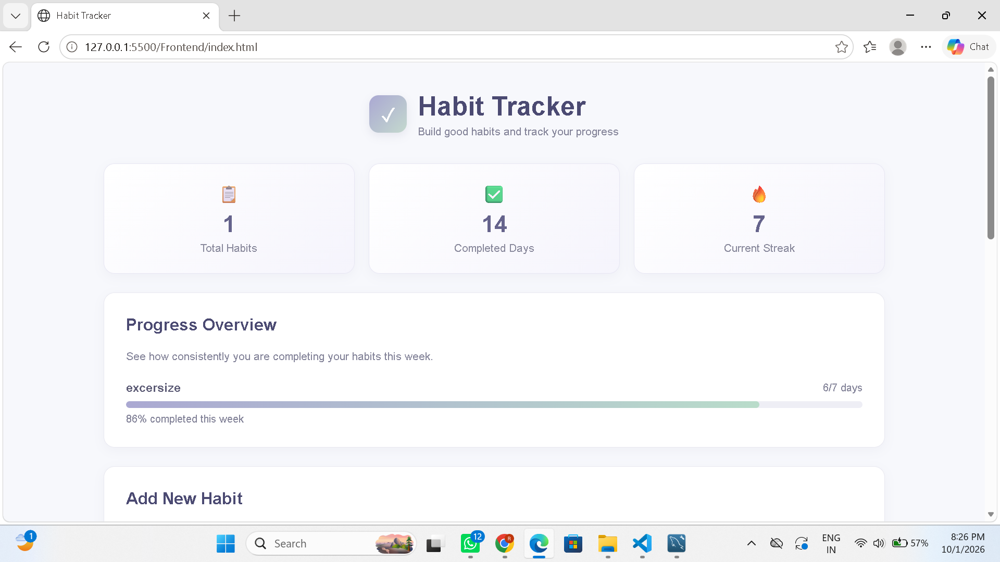
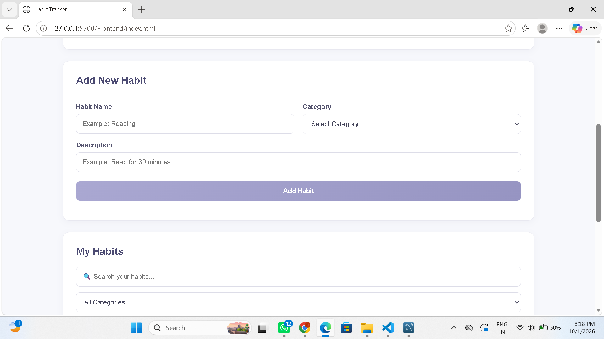
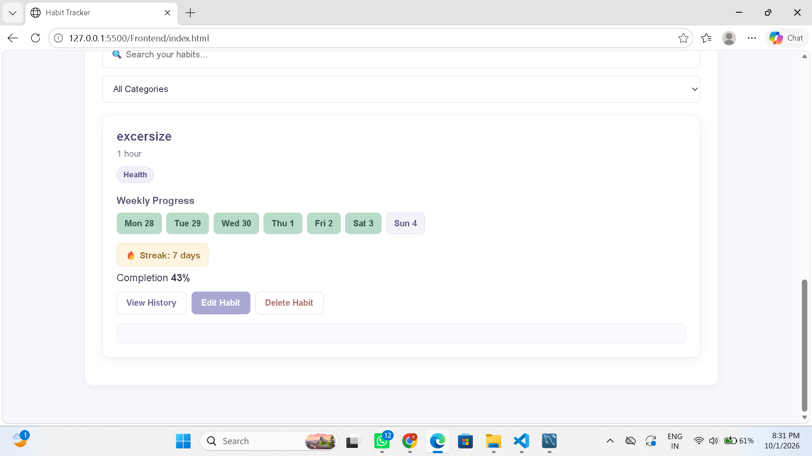

Habit Tracker
1. Project Title

Habit Tracker – A Full-Stack Habit Management and Tracking Application

2. Problem Statement

Maintaining good habits consistently can be difficult when there is no simple way to record daily activities and monitor progress.

The Habit Tracker application is developed to help users create, manage, and monitor their daily habits. The application allows users to add habits, track their completion, monitor weekly progress, calculate streaks, and view their completion history.

The application is developed using frontend, backend, and database technologies to provide complete habit management functionality.

3. Assigned Feature Set

Problem Number: 2

Assigned Feature Set: Feature Set 3

The assigned feature set requires the development of a Habit Tracker application with frontend, backend, and database functionality.

The application implements habit creation, habit management, daily completion tracking, progress monitoring, streak calculation, and completion history.

4. Features Implemented

• Add new habits
• Edit existing habits
• Delete habits
• Add habit description
• Assign categories to habits
• Track habit completion for each day
• Weekly habit progress tracking
• Current streak calculation
• Completion history
• Dashboard statistics
• Weekly progress overview
• Progress percentage display
• Search habits
• Filter habits by category
• Responsive user interface
• Clean and professional user interface

Dashboard

The dashboard displays:

• Total Habits
• Completed Days
• Current Streak
• Weekly Progress Overview

Habit Categories

Users can categorize habits as:

• Study
• Health
• Fitness
• Personal
• Other

5. Technologies Used
Frontend

• HTML5
• CSS3
• JavaScript

Backend

• Node.js
• Express.js
• CORS

Database

• MySQL
• MySQL2

Development Tools

• Visual Studio Code
• MySQL Workbench
• Git
• GitHub
• Live Server

6. AI Tools Used

AI Tool Used: ChatGPT

ChatGPT was used as an AI-assisted development tool during the development of the project.

It was used for:

• Understanding the project requirements
• Planning the project structure
• Developing frontend code
• Developing backend APIs
• Database-related guidance
• Debugging errors
• Improving the user interface
• Implementing additional features
• Troubleshooting JavaScript and API issues
• Preparing project documentation

The AI-generated suggestions and code were reviewed, tested, modified, and integrated according to the project requirements.

7. Important AI Prompts / AI Usage

Some of the important prompts used during the development of the project were:

Project Development:
“I want to create a Habit Tracker website with frontend, backend and database. Give me step-by-step guidance because I am a beginner.”

UI Design:
“I want my website to have a clean and professional look with light colours, small amounts of bright colours and gradient. I don't want it to look too colourful.”

Dashboard:
“Add a dashboard section that shows total habits, completed days, current streak and weekly progress overview.”

Habit Tracking:
“Implement weekly habit tracking where I can click on a particular day and mark the habit as completed.”

Streak Calculation:
“Add functionality to calculate the current consecutive streak for each habit.”

Search and Filter:
“Add search functionality and category filtering to my habit list.”

Debugging:
“Check my HTML, CSS, JavaScript and backend code and identify errors. Give me the corrected code.”

Date Issue:
“When I click on a particular day, the green completed colour is appearing on the previous day. Check the date handling and fix the issue.”

Documentation:
“Create a professional README file for my Habit Tracker project including the project details, technologies, features and screenshots.”

8. Instructions to Run the Project
Prerequisites

The following software is required:

• Node.js
• MySQL
• MySQL Workbench
• Visual Studio Code
• Live Server extension

Step 1: Clone the Repository

Clone the project from GitHub and open the project folder in Visual Studio Code.

Step 2: Set Up the Database

Open MySQL Workbench and create the database:

Database Name: habit_tracker

Create the required tables for storing habits and habit completion records.

Step 3: Configure Database Connection

Open the db.js file inside the Backend folder.

Configure the MySQL connection according to your local MySQL username, password, and database.

Step 4: Install Backend Dependencies

Open the terminal inside the Backend folder and run:

npm install

Step 5: Start the Backend Server

Run:

node server.js

The backend server will run on:

http://localhost:5000

Step 6: Run the Frontend

Open the Frontend folder in Visual Studio Code.

Open index.html using the Live Server extension.

The Habit Tracker application will then open in the browser.

9. Screenshots of the Working Project

The following screenshots show the working Habit Tracker application.

Dashboard

This screenshot shows the dashboard containing Total Habits, Completed Days, Current Streak, and Weekly Progress Overview.

Add New Habit

This screenshot shows the Add New Habit section where users can enter the habit name, description, and category.

My Habits

This screenshot shows the created habits along with weekly tracking, streak information, history, edit, and delete options.

Project Structure

Habit-tracker

• Frontend
 • index.html
 • style.css
 • script.js

• Backend
 • server.js
 • db.js

• output
 • dashboard.png
 • add-habit.png
 • my-habits.png

• README.md

Author

Rutuja Latkar

BCA Student
